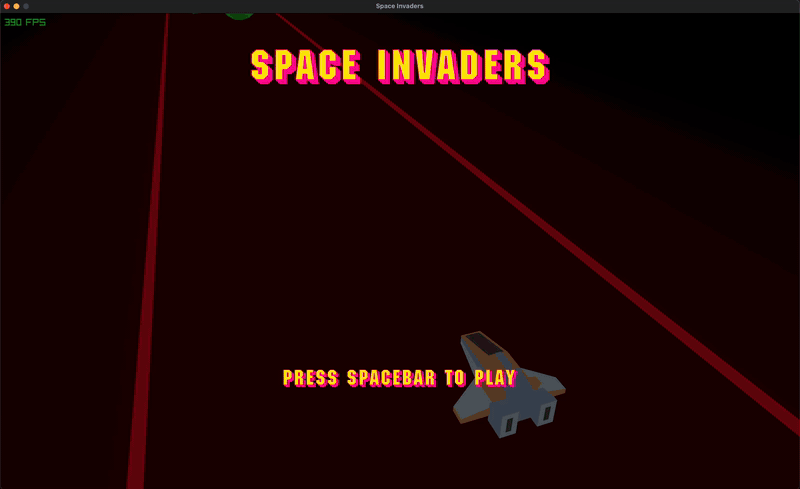

# Space Shooters

<p align="center">
  
</p>

A high-performance, Synthwave-inspired 3D space shooter built in **C** using **Raylib**. Implements a **Data-Oriented Design (DOD)** architecture with a custom rendering pipeline and optimized collision mathematics.

---

## Table of Contents

- [Technical Highlights](#technical-highlights)
- [Getting Started](#getting-started)
- [Architecture & Design](#architecture--design)
- [Controls](#controls)
- [License](#license)

---

## Technical Highlights

| Feature | Implementation |
| :--- | :--- |
| **Data-Oriented Architecture** | Structure of Arrays (SoA) for maximum CPU cache efficiency and SIMD-readiness |
| **Custom Rendering Pipeline** | Halation floor effect via `rlgl` vertex interpolation and Additive Blending |
| **Optimized Collision Math** | Compile-time constant radii and squared-distance comparisons eliminating `sqrt()` overhead |
| **Shared Mesh Architecture** | Single VRAM footprint across all entity instances via mesh ownership pattern |
| **GLSL Shader Integration** | Real-time fragment shaders for hit-flash effects, driven by CPU-GPU uniform bridge |

---

## Getting Started

### Prerequisites

You will need **Clang/GCC** (or MSVC on Windows), **CMake**, and **Raylib**.

#### macOS

Install via Homebrew:

```bash
brew install raylib cmake
```

#### Linux (Debian / Ubuntu)

Install the required system dependencies, then build Raylib from source or install via your package manager:

```bash
sudo apt update
sudo apt install build-essential cmake libraylib-dev
```

> If `libraylib-dev` is unavailable in your distribution's repos, install Raylib manually from [raylib.com](https://www.raylib.com) or via the official GitHub releases.

#### Windows

1. Install [CMake](https://cmake.org/download/) and add it to your system `PATH`
2. Install [MinGW-w64](https://www.mingw-w64.org/) (GCC for Windows) or use the [MSVC toolchain](https://visualstudio.microsoft.com/visual-cpp-build-tools/) via Visual Studio Build Tools
3. Download the prebuilt Raylib binaries for Windows from [raylib.com](https://www.raylib.com) and note the install path — you will need it during the CMake configuration step

---

### Installation

```bash
git clone https://github.com/ukasha167/space-shooters.git
cd space-shooters
```

---

### Building

#### macOS & Linux

```bash
mkdir build && cd build
cmake ..
cmake --build .
```

#### Windows (MinGW)

```bash
mkdir build && cd build
cmake .. -G "MinGW Makefiles" -DCMAKE_PREFIX_PATH="C:/path/to/raylib"
cmake --build .
```

#### Windows (MSVC)

```bash
mkdir build && cd build
cmake .. -DCMAKE_PREFIX_PATH="C:/path/to/raylib"
cmake --build . --config Release
```

Or just open the project in Visual Studio, it will automatically download the dependencies. After it's completed, hit play.

---

### Running

#### macOS & Linux

```bash
./main
```

#### Windows

```bash
main.exe
```

---

## Architecture & Design

### I. Data-Oriented Design — Structure of Arrays (SoA)

Traditional game entities use **Array of Structures (AoS)** — each entity is a self-contained object holding all its own fields. SoA inverts this: each *attribute* gets its own contiguous array.

```
AoS:  [pos, speed, active, rot] [pos, speed, active, rot] [pos, speed, active, rot]
SoA:  [pos, pos, pos]  [speed, speed, speed]  [active, active, active]
```

When the update loop iterates positions, the CPU cache line is packed exclusively with position data — no cache pollution from cold fields like rotation axes. This is the foundation for potential SIMD vectorization in future iterations.

---

### II. Halation Rendering Pattern

Full-screen bloom post-processing is expensive. This project achieves a Synthwave neon glow through a **Layered Additive Pipeline** at near-zero overhead:

- Vertices are manually defined via `rlgl` with alpha gradients baked in
- Rendered under `BLEND_ADDITIVE` mode, causing overlapping fragments to sum their color values
- The GPU produces a bright, saturated core that bleeds naturally into the surrounding void

No framebuffer copies. No ping-pong render targets. Pure per-vertex math.

---

### III. Collision System

Collision detection runs two passes per frame — lazers vs. meteors, then ship vs. meteors — using the following optimization chain:

**Squared-Distance Elimination**

```c
// Never computed:
float dist = sqrt(dx*dx + dy*dy + dz*dz);

// What actually runs — algebraically equivalent, no sqrt:
return (dx*dx + dy*dy + dz*dz) <= (r1 + r2) * (r1 + r2);
```

The sum-of-radii is a compile-time constant, so `(r1 + r2)²` is precomputed by the preprocessor and never evaluated at runtime.

---

### IV. Shared Mesh Architecture

Raylib's `UnloadModel()` frees the underlying mesh data. Naively sharing one mesh pointer across multiple `Model` structs causes a **double-free crash** on cleanup.

**Solution — Ownership Hijacking:**

One model is designated the master owner. All secondary `Model` shells reference the same mesh pointer but have their `.meshCount` set to `0` before cleanup. Raylib's unload routine skips mesh deallocation when the count is zero, leaving the vertex data intact until the master owner releases it last.

This keeps VRAM usage at a single mesh upload regardless of how many model shells reference it.

---

## Controls

| Action | Input |
| :--- | :--- |
| Move | `A` `D` / `<–` `–>`|
| Shoot | `Space` |
| Start | `Space` |

---

## License

Distributed under the **MIT License** — see [`LICENSE`](LICENSE) for details.
